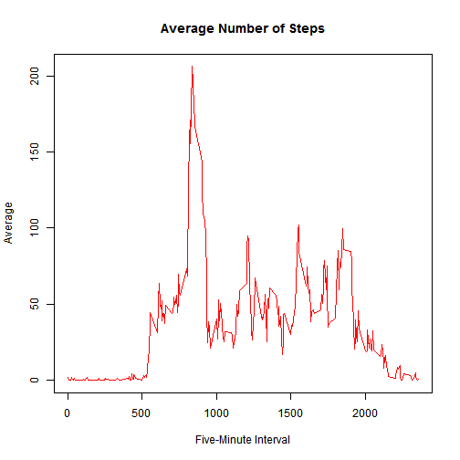

## Loading and preprocessing the data

```r
## Code for reading in the dataset and/or processing the data
library(lattice)
file_url <- "https://d396qusza40orc.cloudfront.net/repdata%2Fdata%2Factivity.zip"
file_dest <- "Activity_Monitoring_Data.zip"

download.file(file_url, file_dest)
unzip(file_dest)

data_NA <- read.csv("activity.csv", colClasses=c("numeric","character","numeric"))
data_NA$date <- as.Date(data_NA$date,"%Y-%m-%d")
data <- data_NA[complete.cases(data_NA),]
```

## What is mean total number of steps taken per day?

```r
## Histogram of the total number of steps taken each day
total_steps <- aggregate(steps ~ date, data = data, sum)
hist(total_steps$steps, main="Total Steps Each Day", xlab="Day", col="blue")
```


```r
## Mean and median number of steps taken each day
steps_mean <- mean(total_steps$steps)
steps_median <- median(total_steps$steps)
print(steps_mean)
```

```
## [1] 10766.19
```

```r
print(steps_median)
```

```
## [1] 10765
```


## What is the average daily activity pattern?

```r
data_time <- tapply(data$steps, data$interval, mean)
plot(row.names(data_time),data_time, type="l", main="Average Number of Steps", xlab="Five-Minute Interval", ylab="Average", col="red")
```



```r
max_steps_interval <- which.max(data_time)
max_steps_interval <- as.numeric(names(max_steps_interval))
print(max_steps_interval)
```

```
## [1] 835
```


## Imputing missing values

```r
ggdata <-  aggregate(steps ~ interval, data=data_NA, FUN=mean, na.rm=FALSE)
meanInterval <- function(interval)
{
  round(ggdata[ggdata$interval==interval,]$steps)
}

filled_data <- data_NA
rows <- nrow(filled_data)
for (i in 1:rows)
{
  if(is.na(filled_data[i,]$steps))
  {
    filled_data[i,]$steps <- meanInterval(filled_data[i,]$interval)
  }
}

data_new <- aggregate(steps ~ date, data=filled_data, FUN=sum, na.rm=TRUE)
hist(data_new$steps, main="Histogram of Total Steps (Filled)", xlab="Total Number of Steps", breaks=10, col="green")
```


## Are there differences in activity patterns between weekdays and weekends?

```r
week_day <- weekdays(filled_data$date)
day_type <- vector()
for(i in 1:nrow(filled_data))
{
  if (week_day[i]=="Saturday")
  {
    day_type[i] <- "Weekend"
  }
  else if (week_day[i]=="Sunday")
  {
    day_type[i] <- "Weekend"
  }
  else
  {
    day_type[i] <- "Weekday"
  }
}

filled_data$day_type <- day_type
filled_data$day_type <- factor(filled_data$day_type)

day_steps <- aggregate(steps ~ interval + day_type, data = filled_data, mean)
names(day_steps) <- c("interval", "day_type", "steps")

xyplot(steps ~ interval | day_type, day_steps, type="l", layout=c(1,2), xlab="Interval", ylab="Number of Steps", col="red")
```


